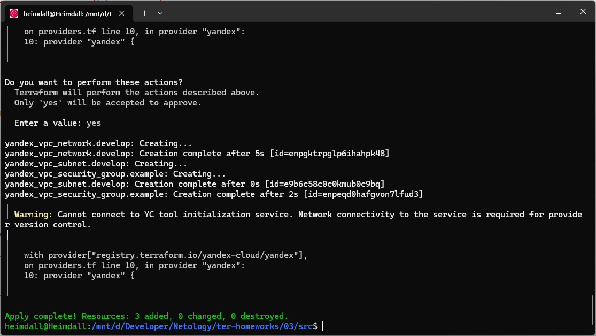
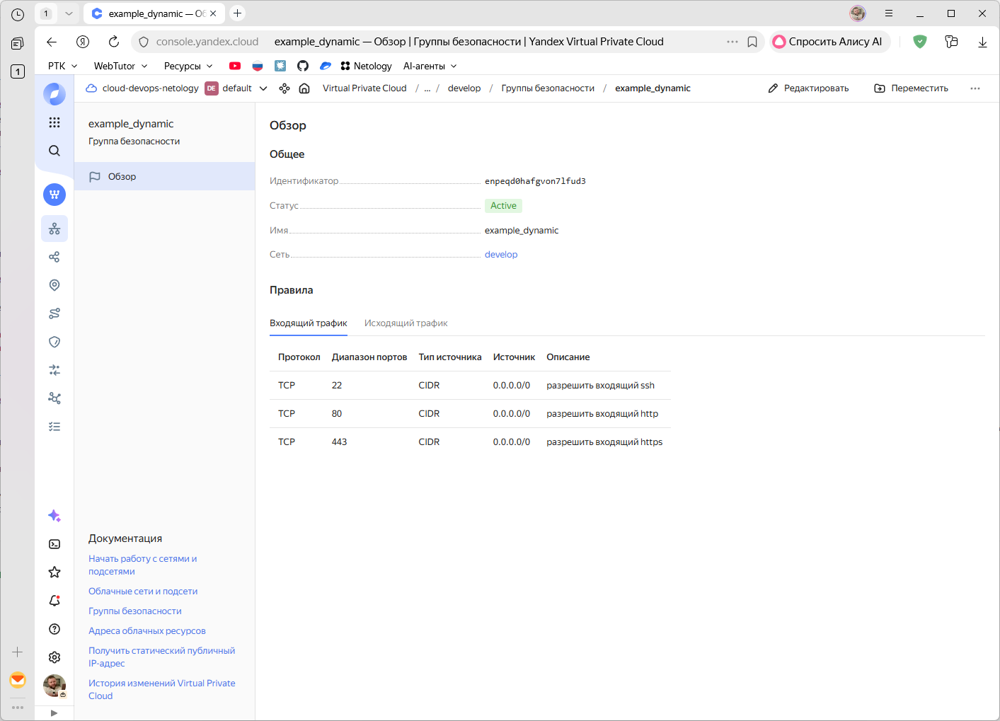
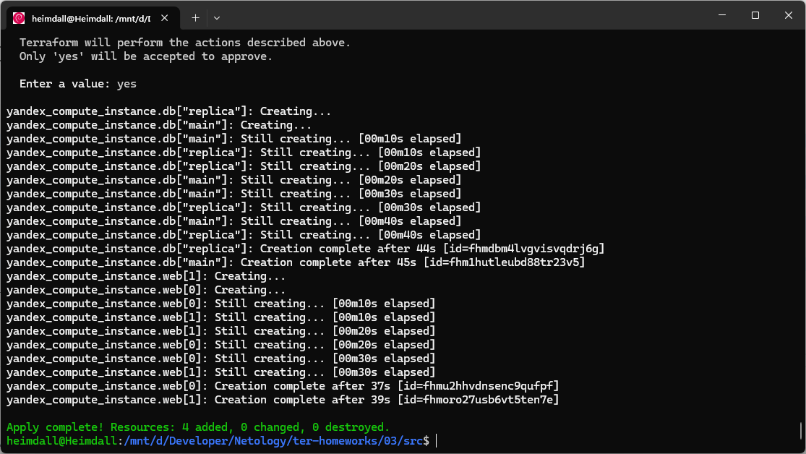
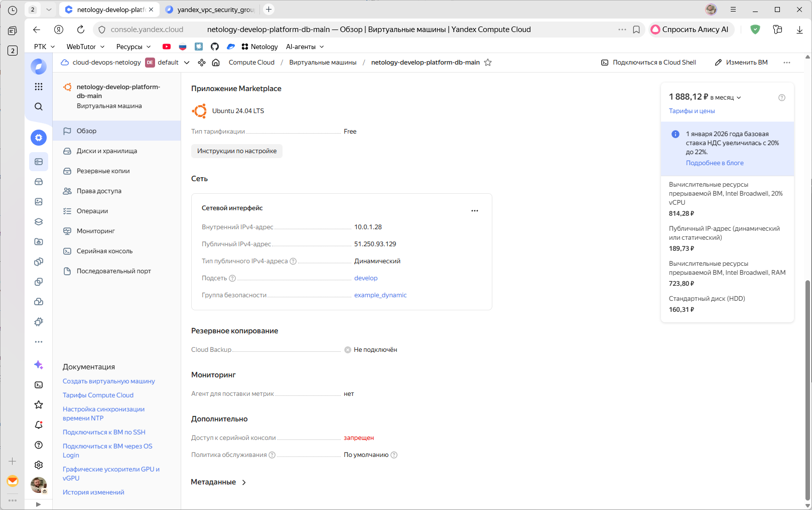

# Домашнее задание к занятию «Управляющие конструкции в коде Terraform»

### Цели задания

1. Отработать основные принципы и методы работы с управляющими конструкциями Terraform.
2. Освоить работу с шаблонизатором Terraform (Interpolation Syntax).

------

### Чек-лист готовности к домашнему заданию

1. Зарегистрирован аккаунт в Yandex Cloud. Использован промокод на грант.
2. Установлен инструмент Yandex CLI.
3. Доступен исходный код для выполнения задания в директории [**03/src**](https://github.com/netology-code/ter-homeworks/tree/main/03/src).
4. Любые ВМ, использованные при выполнении задания, должны быть прерываемыми, для экономии средств.

------

### Внимание!! Обязательно предоставляем на проверку получившийся код в виде ссылки на ваш github-репозиторий!
Убедитесь что ваша версия **Terraform** ~>1.12.0
Теперь пишем красивый код, хардкод значения не допустимы!
------

### Задание 1

1. Изучите проект.
2. Инициализируйте проект, выполните код. 


Приложите скриншот входящих правил «Группы безопасности» в ЛК Yandex Cloud .

> ### Ответ:
> Внес изменения в ограничения версии провайдера
> 
> 
> 
> 

------

### Задание 2

1. Создайте файл count-vm.tf. Опишите в нём создание двух **одинаковых** ВМ  web-1 и web-2 (не web-0 и web-1) с минимальными параметрами, используя мета-аргумент **count loop**. Назначьте ВМ созданную в первом задании группу безопасности.(как это сделать узнайте в документации провайдера yandex/compute_instance )
2. Создайте файл for_each-vm.tf. Опишите в нём создание двух ВМ для баз данных с именами "main" и "replica" **разных** по cpu/ram/disk_volume , используя мета-аргумент **for_each loop**. Используйте для обеих ВМ одну общую переменную типа:
```
variable "each_vm" {
  type = list(object({  vm_name=string, cpu=number, ram=number, disk_volume=number }))
}
```  
При желании внесите в переменную все возможные параметры.
3. ВМ из пункта 2.1 должны создаваться после создания ВМ из пункта 2.2.
4. Используйте функцию file в local-переменной для считывания ключа ~/.ssh/id_rsa.pub и его последующего использования в блоке metadata, взятому из ДЗ 2.
5. Инициализируйте проект, выполните код.

> ### Ответ:
> 
> Создал файл `vm_web_variables.tf` с пеерменными для web
> ```
> variable "vm_web_image_family" {
>   type = string
>   default = "ubuntu-2404-lts-oslogin"
>   description = "Образ ОС"
> }
> 
> variable "vm_web_prefix_name" {
>   type = string
>   default = "netology-develop-platform-web"
>   description = "Префикс имени ВМ"
> }
> 
> variable "vm_web_cores" {
>   type        = number
>   default     = 2
>   description = "CPU"
> }
> 
> variable "vm_web_memory" {
>   type        = number
>   default     = 2
>   description = "RAM"
> }
> 
> variable "vm_web_core_fraction" {
>   type        = number
>   default     = 20
>   description = "Доля CPU"
> }
> 
> variable "vm_web_disk_size" {
>   type        = number
>   default     = 10
>   description = "Размер диска"
> }
> 
> variable "vm_web_nat" {
>   type        = bool
>   default     = true
>   description = "Включить NAT"
> }
> 
> variable "vm_web_preemptible" {
>   type        = bool
>   default     = true
>   description = "Прерываемая ВМ"
> }
> ```
> 
> Создал файл `count-vm.tf` для создания самих ВМ
> ```
> #считываем данные об образе ОС
> data "yandex_compute_image" "web_image" {
>   family = var.vm_web_image_family
> }
> 
> #создаем ВМ
> resource "yandex_compute_instance" "web" {
>   depends_on = [yandex_compute_instance.db]
>   count = 2
>   name = "${var.vm_web_prefix_name}-${count.index + 1}"
> 
>   resources {
>     cores         = var.vm_web_cores
>     memory        = var.vm_web_memory
>     core_fraction = var.vm_web_core_fraction
>   }
> 
>   boot_disk {
>     initialize_params {
>       image_id = data.yandex_compute_image.web_image.image_id
>       size     = var.vm_web_disk_size
>       type     = "network-hdd"
>     }
>   }
> 
>   network_interface {
>     subnet_id = yandex_vpc_subnet.develop.id
>     nat       = var.vm_web_nat
>     security_group_ids = [
>       yandex_vpc_security_group.example.id
>     ]
>   }
> 
>   scheduling_policy {
>     preemptible = var.vm_web_preemptible
>   }
> 
>   metadata = {
>     ssh-keys = local.ssh_public_key
>   }
> }
> ```
> 
> Создал файл `vm_db_variables.tf` с переменными для БД
> ```
> variable "each_vm" {
>   type = list(object({
>     vm_name     = string
>     cpu         = number
>     ram         = number
>     disk_volume = number
>   }))
> 
>   # пример значений (можно вынести в terraform.tfvars)
>   default = [
>     {
>       vm_name     = "main"
>       cpu         = 4
>       ram         = 8
>       disk_volume = 50
>     },
>     {
>       vm_name     = "replica"
>       cpu         = 2
>       ram         = 4
>       disk_volume = 30
>     }
>   ]
> }
> 
> variable "vm_db_image_family" {
>   type = string
>   default = "ubuntu-2404-lts-oslogin"
>   description = "Образ ОС"
> }
> 
> variable "vm_db_prefix_name" {
>   type = string
>   default = "netology-develop-platform-db"
>   description = "Префикс имени ВМ"
> }
> 
> variable "vm_db_core_fraction" {
>   type        = number
>   default     = 20
>   description = "Доля CPU"
> }
> 
> variable "vm_db_nat" {
>   type        = bool
>   default     = true
>   description = "Включить NAT"
> }
> 
> variable "vm_db_preemptible" {
>   type        = bool
>   default     = true
>   description = "Прерываемая ВМ"
> }
> 
> ```
> 
> Создал файл `for_each-vm.tf` для создания самих ВМ с БД
> ```
> #считываем данные об образе ОС
> data "yandex_compute_image" "db_image" {
>   family = var.vm_db_image_family
> }
> 
> #создаем ВМ
> resource "yandex_compute_instance" "db" {
>   for_each = { for vm in var.each_vm : vm.vm_name => vm }
> 
>   name = "${var.vm_db_prefix_name}-${each.value.vm_name}"
> 
>   resources {
>     cores         = each.value.cpu
>     memory        = each.value.ram
>     core_fraction = var.vm_db_core_fraction
>   }
> 
>   boot_disk {
>     initialize_params {
>       image_id = data.yandex_compute_image.db_image.image_id
>       size     = each.value.disk_volume
>       type     = "network-hdd"
>     }
>   }
> 
>   network_interface {
>     subnet_id = yandex_vpc_subnet.develop.id
>     nat       = var.vm_db_nat
>   }
> 
>   scheduling_policy {
>     preemptible = var.vm_db_preemptible
>   }
> 
>   metadata = {
>     ssh-keys = local.ssh_public_key
>   }
> }
> ```
> 
> Добавил отдельно файл `locals.tf` для локальных переменных (не уверен что так правильно выносить, возможно надо было просто в main.tf добавить)
> ```
> locals {
>   ssh_public_key = "ubuntu:${file(pathexpand(var.ssh_key_path))}"
> }
> ```
> 
> Путь к SSH ключу вынес в переменную и добавил в файл `variables.tf`
> ```
> [остальные пременные]
> 
> variable "ssh_key_path" {
>   type = string
>   default = "~/.ssh/id_ed25519.pub"
>   description = "Путь до ключа SSH"
> }
> ```
> 
> Выполнил проект  
> 
> 
> 

------

### Задание 3

1. Создайте 3 одинаковых виртуальных диска размером 1 Гб с помощью ресурса yandex_compute_disk и мета-аргумента count в файле **disk_vm.tf** .
2. Создайте в том же файле **одиночную**(использовать count или for_each запрещено из-за задания №4) ВМ c именем "storage"  . Используйте блок **dynamic secondary_disk{..}** и мета-аргумент for_each для подключения созданных вами дополнительных дисков.

------

### Задание 4

1. В файле ansible.tf создайте inventory-файл для ansible.
Используйте функцию tepmplatefile и файл-шаблон для создания ansible inventory-файла из лекции.
Готовый код возьмите из демонстрации к лекции [**demonstration2**](https://github.com/netology-code/ter-homeworks/tree/main/03/demo).
Передайте в него в качестве переменных группы виртуальных машин из задания 2.1, 2.2 и 3.2, т. е. 5 ВМ.
2. Инвентарь должен содержать 3 группы и быть динамическим, т. е. обработать как группу из 2-х ВМ, так и 999 ВМ.
3. Добавьте в инвентарь переменную  [**fqdn**](https://cloud.yandex.ru/docs/compute/concepts/network#hostname).
``` 
[webservers]
web-1 ansible_host=<внешний ip-адрес> fqdn=<полное доменное имя виртуальной машины>
web-2 ansible_host=<внешний ip-адрес> fqdn=<полное доменное имя виртуальной машины>

[databases]
main ansible_host=<внешний ip-адрес> fqdn=<полное доменное имя виртуальной машины>
replica ansible_host<внешний ip-адрес> fqdn=<полное доменное имя виртуальной машины>

[storage]
storage ansible_host=<внешний ip-адрес> fqdn=<полное доменное имя виртуальной машины>
```
Пример fqdn: ```web1.ru-central1.internal```(в случае указания переменной hostname(не путать с переменной name)); ```fhm8k1oojmm5lie8i22a.auto.internal```(в случае отсутвия перменной hostname - автоматическая генерация имени,  зона изменяется на auto). нужную вам переменную найдите в документации провайдера или terraform console.
4. Выполните код. Приложите скриншот получившегося файла. 

Для общего зачёта создайте в вашем GitHub-репозитории новую ветку terraform-03. Закоммитьте в эту ветку свой финальный код проекта, пришлите ссылку на коммит.   
**Удалите все созданные ресурсы**.

------

## Дополнительные задания (со звездочкой*)

**Настоятельно рекомендуем выполнять все задания со звёздочкой.** Они помогут глубже разобраться в материале.   
Задания со звёздочкой дополнительные, не обязательные к выполнению и никак не повлияют на получение вами зачёта по этому домашнему заданию. 

### Задание 5* (необязательное)
1. Напишите output, который отобразит ВМ из ваших ресурсов count и for_each в виде списка словарей :
``` 
[
 {
  "name" = 'имя ВМ1'
  "id"   = 'идентификатор ВМ1'
  "fqdn" = 'Внутренний FQDN ВМ1'
 },
 {
  "name" = 'имя ВМ2'
  "id"   = 'идентификатор ВМ2'
  "fqdn" = 'Внутренний FQDN ВМ2'
 },
 ....
...итд любое количество ВМ в ресурсе(те требуется итерация по ресурсам, а не хардкод) !!!!!!!!!!!!!!!!!!!!!
]
```
Приложите скриншот вывода команды ```terrafrom output```.

------

### Задание 6* (необязательное)

1. Используя null_resource и local-exec, примените ansible-playbook к ВМ из ansible inventory-файла.
Готовый код возьмите из демонстрации к лекции [**demonstration2**](https://github.com/netology-code/ter-homeworks/tree/main/03/demo).
3. Модифицируйте файл-шаблон hosts.tftpl. Необходимо отредактировать переменную ```ansible_host="<внешний IP-address или внутренний IP-address если у ВМ отсутвует внешний адрес>```.

Для проверки работы уберите у ВМ внешние адреса(nat=false). Этот вариант используется при работе через bastion-сервер.
Для зачёта предоставьте код вместе с основной частью задания.

### Правила приёма работы

В своём git-репозитории создайте новую ветку terraform-03, закоммитьте в эту ветку свой финальный код проекта. Ответы на задания и необходимые скриншоты оформите в md-файле в ветке terraform-03.

В качестве результата прикрепите ссылку на ветку terraform-03 в вашем репозитории.

Важно. Удалите все созданные ресурсы.

### Задание 7* (необязательное)
Ваш код возвращает вам следущий набор данных: 
```
> local.vpc
{
  "network_id" = "enp7i560tb28nageq0cc"
  "subnet_ids" = [
    "e9b0le401619ngf4h68n",
    "e2lbar6u8b2ftd7f5hia",
    "b0ca48coorjjq93u36pl",
    "fl8ner8rjsio6rcpcf0h",
  ]
  "subnet_zones" = [
    "ru-central1-a",
    "ru-central1-b",
    "ru-central1-c",
    "ru-central1-d",
  ]
}
```
Предложите выражение в terraform console, которое удалит из данной переменной 3 элемент из: subnet_ids и subnet_zones.(значения могут быть любыми) Образец конечного результата:
```
> <некое выражение>
{
  "network_id" = "enp7i560tb28nageq0cc"
  "subnet_ids" = [
    "e9b0le401619ngf4h68n",
    "e2lbar6u8b2ftd7f5hia",
    "fl8ner8rjsio6rcpcf0h",
  ]
  "subnet_zones" = [
    "ru-central1-a",
    "ru-central1-b",
    "ru-central1-d",
  ]
}
```
### Задание 8* (необязательное)
Идентифицируйте и устраните намеренно допущенную в tpl-шаблоне ошибку. Обратите внимание, что terraform сам сообщит на какой строке и в какой позиции ошибка!
```
[webservers]
%{~ for i in webservers ~}
${i["name"]} ansible_host=${i["network_interface"][0]["nat_ip_address"] platform_id=${i["platform_id "]}}
%{~ endfor ~}
```

### Задание 9* (необязательное)
Напишите  terraform выражения, которые сформируют списки:
1. ["rc01","rc02","rc03","rc04",rc05","rc06",rc07","rc08","rc09","rc10....."rc99"] те список от "rc01" до "rc99"
2. ["rc01","rc02","rc03","rc04",rc05","rc06","rc11","rc12","rc13","rc14",rc15","rc16","rc19"....."rc96"] те список от "rc01" до "rc96", пропуская все номера, заканчивающиеся на "0","7", "8", "9", за исключением "rc19"

### Критерии оценки

Зачёт ставится, если:

* выполнены все задания,
* ответы даны в развёрнутой форме,
* приложены соответствующие скриншоты и файлы проекта,
* в выполненных заданиях нет противоречий и нарушения логики.

На доработку работу отправят, если:

* задание выполнено частично или не выполнено вообще,
* в логике выполнения заданий есть противоречия и существенные недостатки. 


