# Домашнее задание к занятию «Использование Terraform в команде»

### Цели задания

1. Научиться использовать remote state с блокировками.
2. Освоить приёмы командной работы.


### Чек-лист готовности к домашнему заданию

1. Зарегистрирован аккаунт в Yandex Cloud. Использован промокод на грант.
2. Установлен инструмент Yandex CLI.
3. Любые ВМ, использованные при выполнении задания, должны быть прерываемыми, для экономии средств.

------
### Внимание!! Обязательно предоставляем на проверку получившийся код в виде ссылки на ваш github-репозиторий!
Убедитесь что ваша версия **Terraform** ~>1.12.0
Пишем красивый код, хардкод значения не допустимы!

------
### Задание 0
1. Прочтите статью: https://neprivet.com/
2. Пожалуйста, распространите данную идею в своем коллективе.


------

### Задание 1

1. Возьмите код:
- из [ДЗ к лекции 4](https://github.com/netology-code/ter-homeworks/tree/main/04/src),
- из [демо к лекции 4](https://github.com/netology-code/ter-homeworks/tree/main/04/demonstration1).
2. Проверьте код с помощью tflint и checkov. Вам не нужно инициализировать этот проект.
3. Перечислите, какие **типы** ошибок обнаружены в проекте (без дублей).

### Ответ к Заданию 1

Проверка tflint ДЗ к лекции 4 и демо к лекции 4

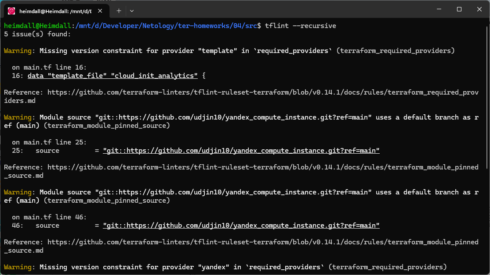
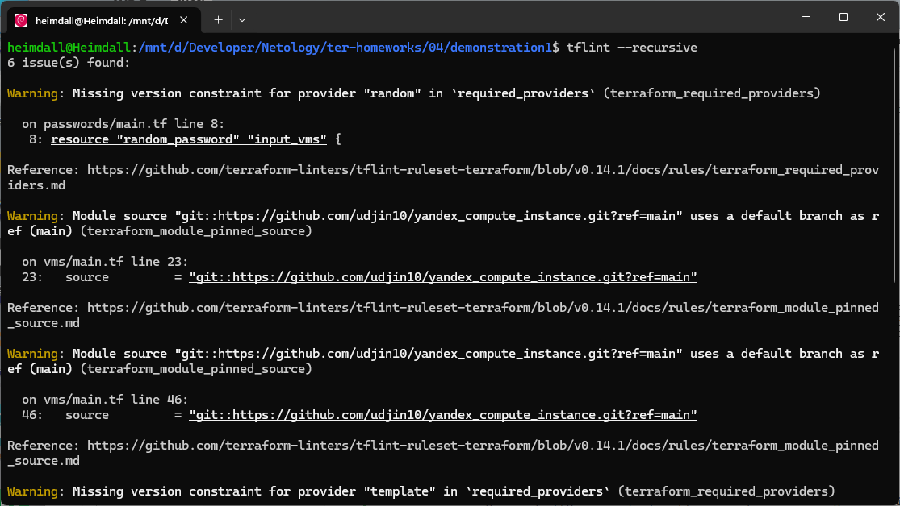

[Результат линтера в файле](./files/1/tflint.txt)

Найденные уникальные ошибки:

* Missing version constraint for provider ...
* Module source "git::https://github.com/udjin10/yandex_compute_instance.git?ref=main" uses a default branch as ref (main)
* [Fixable] variable "public_key" is declared but not used

Проверка chekov ДЗ к лекции 4 и демо к лекции 4

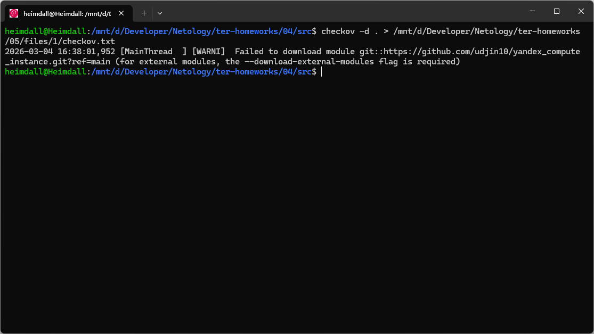
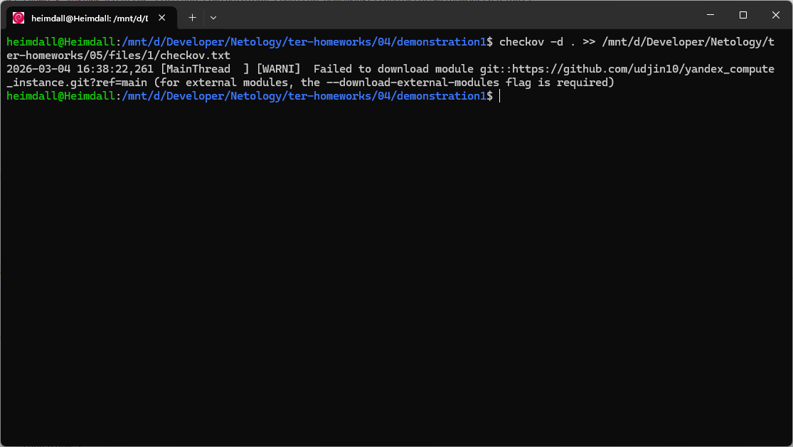

[Результат линтера в файле](./files/1/checkov.txt)

Найденные уникальные ошибки:

* Ensure Terraform module sources use a commit hash
* Ensure Terraform module sources use a tag with a version number

------

### Задание 2

1. Возьмите ваш GitHub-репозиторий с **выполненным ДЗ 4** в ветке 'terraform-04' и сделайте из него ветку 'terraform-05'.
2. Настройте remote state с встроенными блокировками:
   - Создайте S3 bucket в Yandex Cloud для хранения state (если еще не создан)
   - Создайте service account с правами на чтение/запись в bucket
   - Настройте backend в providers.tf с использованием нового механизма блокировок:
     ```hcl
     terraform {
       required_version = "~>1.12.0"
       
       backend "s3" {
         bucket  = "ваш-bucket-name"
         key     = "terraform.tfstate"
         region  = "ru-central1"
         
         # Встроенный механизм блокировок (Terraform >= 1.6)
         # Не требует отдельной базы данных!
         use_lockfile = true
         
         endpoints = {
           s3 = "https://storage.yandexcloud.net"
         }
         
         skip_region_validation      = true
         skip_credentials_validation = true
         skip_requesting_account_id  = true
         skip_s3_checksum            = true
       }
     }
     ```
   - Выполните `terraform init -migrate-state` для миграции state в S3
   - Предоставьте скриншоты процесса настройки и миграции
3. Закоммитьте в ветку 'terraform-05' все изменения.
4. Откройте в проекте terraform console, а в другом окне из этой же директории попробуйте запустить terraform apply.
5. Пришлите ответ об ошибке доступа к state (блокировка должна сработать автоматически).
6. Принудительно разблокируйте state командой `terraform force-unlock <LOCK_ID>`. Пришлите команду и вывод.

**Примечание:** В Terraform >= 1.6 появился встроенный механизм блокировок через `use_lockfile = true`. 
Это упрощает настройку - больше не нужно создавать отдельную базу данных (YDB в режиме DynamoDB) для хранения блокировок.
Lock-файл создается автоматически в том же S3 bucket рядом с state-файлом с именем `<key>.lock.info`.

### Ответ к Заданию 2

Бакет в облаке
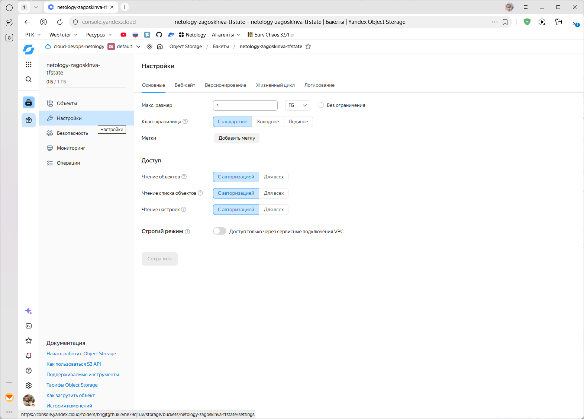

Настройка backend, файл `providers.tf`
``` hcl
terraform {
  required_providers {
    yandex = {
      source = "yandex-cloud/yandex"
    }
  }
  required_version = ">=1.12.0"

  backend "s3" {
    bucket  = "netology-zagoskinva-tfstate"
    key     = "terraform.tfstate"
    region  = "ru-central1"

    encrypt = false

    # Встроенный механизм блокировок (Terraform >= 1.6)
    # Не требует отдельной базы данных!
    use_lockfile = true

    endpoints = {
      s3 = "https://storage.yandexcloud.net"
    }

    skip_region_validation      = true
    skip_credentials_validation = true
    skip_requesting_account_id  = true
    skip_s3_checksum            = true
  }
}

provider "yandex" {
  cloud_id  = var.cloud_id
  folder_id = var.folder_id
  zone      = var.default_zone
  service_account_key_file = file("~/.authorized_key.json")
}
```

Результат запуска команды `terraform init -migrate-state`
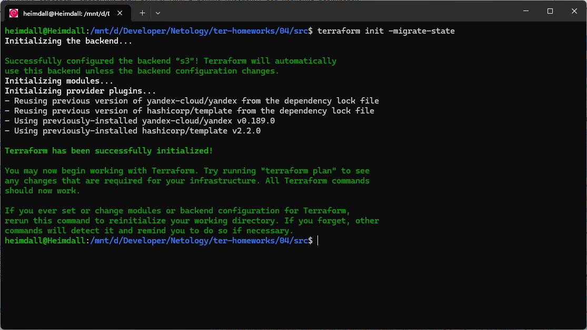

Блокировка state работает
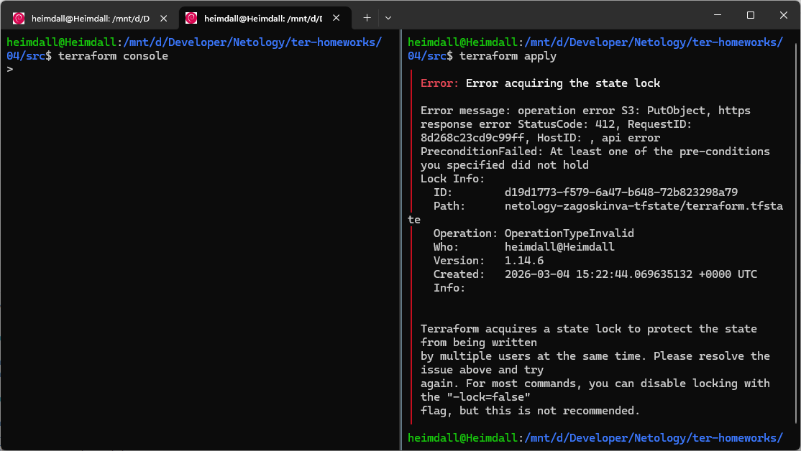

Принудительная разблокировка state
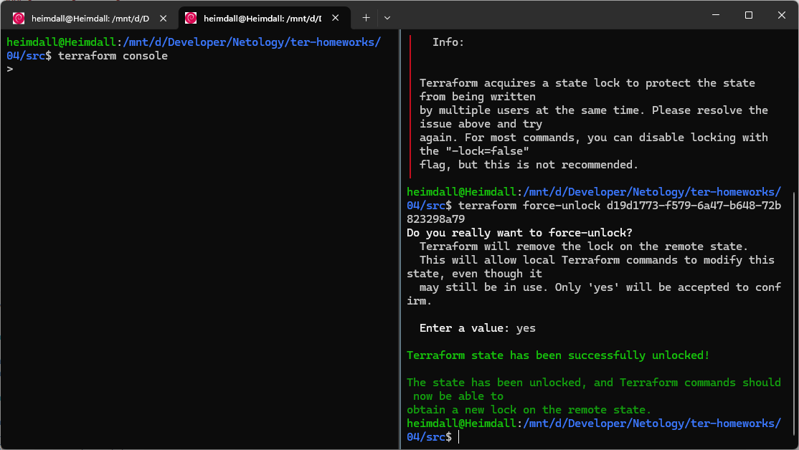

Успешное создание ресурсов
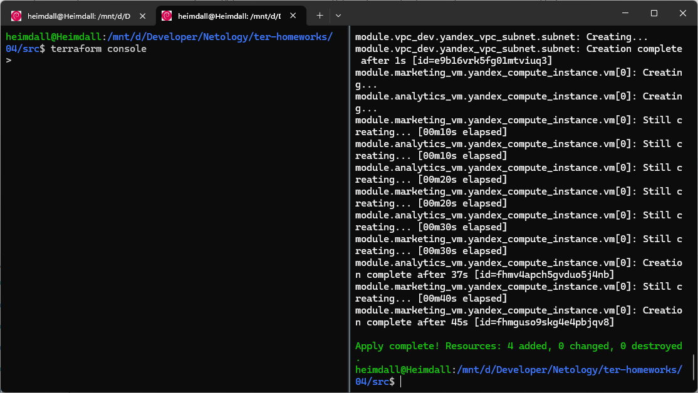

Стейт в хранилище
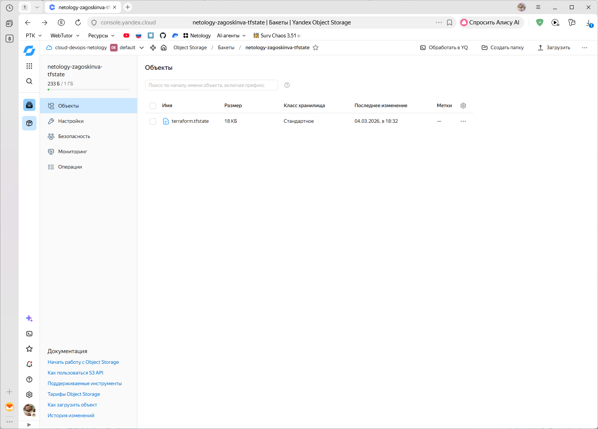

------
### Задание 3  

1. Сделайте в GitHub из ветки 'terraform-05' новую ветку 'terraform-hotfix'.
2. Проверье код с помощью tflint и checkov, исправьте все предупреждения и ошибки в 'terraform-hotfix', сделайте коммит.
3. Откройте новый pull request 'terraform-hotfix' --> 'terraform-05'. 
4. Вставьте в комментарий PR результат анализа tflint и checkov, план изменений инфраструктуры из вывода команды terraform plan.
5. Пришлите ссылку на PR для ревью. Вливать код в 'terraform-05' не нужно.

### Ответ к Заданию 3

Если я правильно понял задание, то нужно проверить код из `ДЗ к лекции 4`...

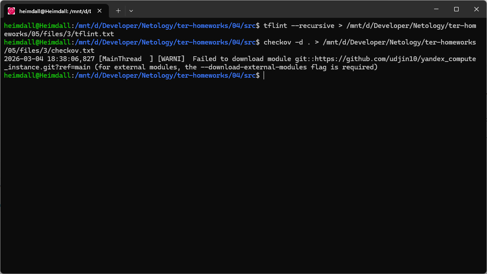

Результат линтеров:
* [tflint](./files/3/tflint.txt)
* [checkov](./files/3/checkov.txt)

Результат исправления по tflint
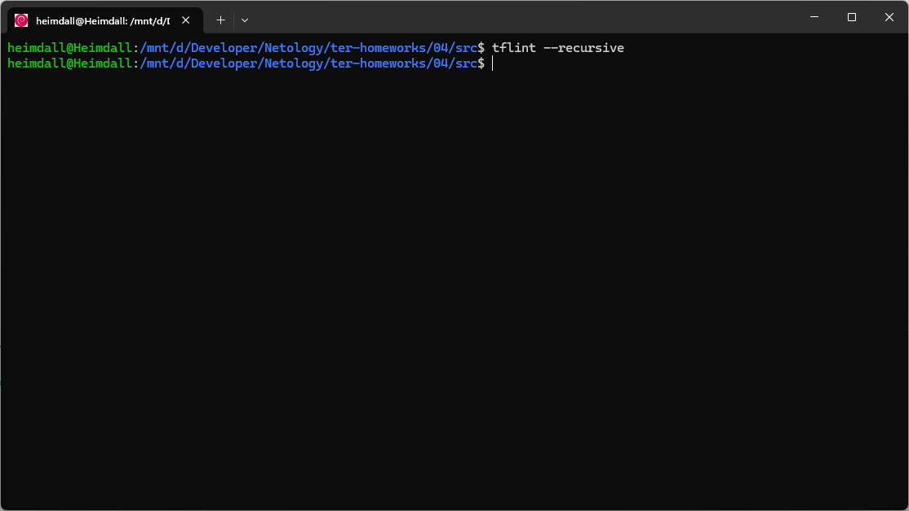
[Вывод tflint в файл](./files/3/tflint_result.txt)

Результат исправления по checkov
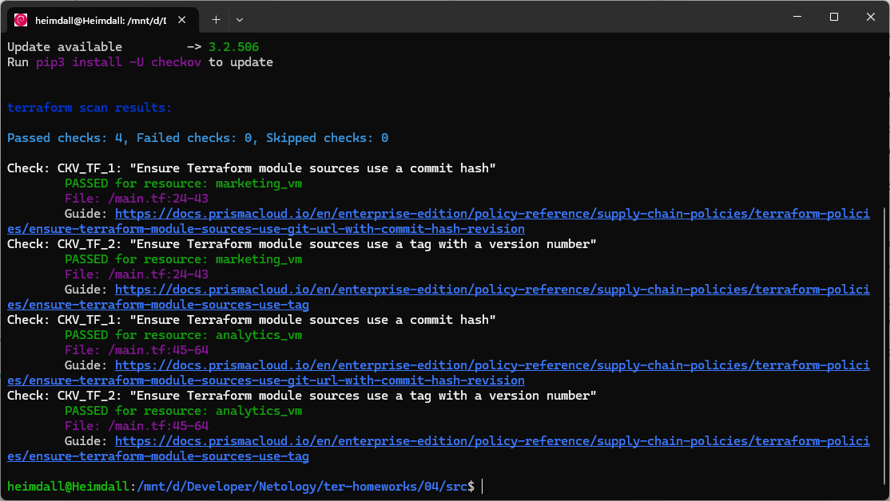
[Вывод checkov в файл](./files/3/checkov_result.txt)

`terraform plan` изначально выдал ошибку, так как вносил исправления в ссылку на модуль, пришлось делать повторный `terraform init`
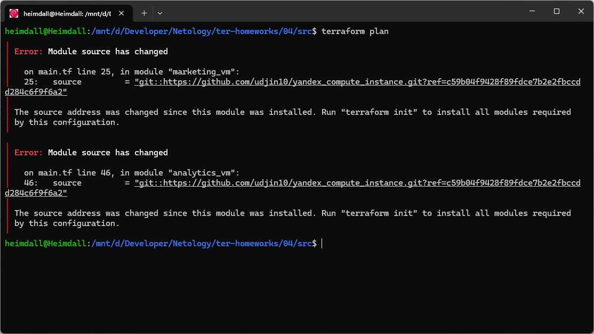
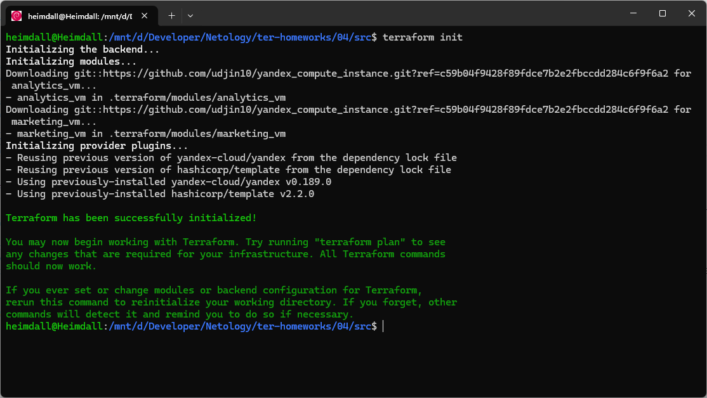
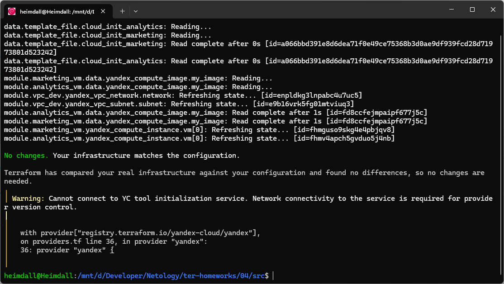
[Вывод plan в файл](./files/3/terraform_plan.txt)

Ссылка на PR - https://github.com/GaliFrey/ter-homework/pull/3

------
### Задание 4

1. Напишите переменные с валидацией и протестируйте их, заполнив default верными и неверными значениями. Предоставьте скриншоты проверок из terraform console. 

- type=string, description="ip-адрес" — проверка, что значение переменной содержит верный IP-адрес с помощью функций cidrhost() или regex(). Тесты:  "192.168.0.1" и "1920.1680.0.1";
- type=list(string), description="список ip-адресов" — проверка, что все адреса верны. Тесты:  ["192.168.0.1", "1.1.1.1", "127.0.0.1"] и ["192.168.0.1", "1.1.1.1", "1270.0.0.1"].

### Ответ к Заданию 4

Создал файл `variables.tf`, где прописал переменные с валидацией. Для тестирования каждой переменной использовал `terraform plan` и в консоле указывал значения.

**Тестирование `ip_address`**
``` hcl
variable "ip_address" {
  type        = string
  description = "ip-адрес"

  validation {
    condition     = can(cidrhost("${var.ip_address}/32", 0))
    error_message = "Указан некорректный IPv4 адрес (пример: 192.168.0.1)"
  }
}
```

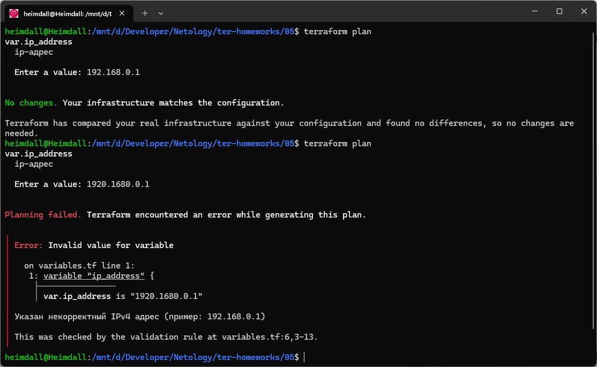

**Тестирование `ip_list`**
``` hcl
variable "ip_list" {
  type        = list(string)
  description = "список ip-адресов"

  validation {
    condition = alltrue([
      for ip in var.ip_list : can(cidrhost("${ip}/32", 0))
    ])
    error_message = "Указан некорректный список IPv4 адресов (пример: [\"192.168.0.1\", \"1.1.1.1\", \"127.0.0.1\"])"
  }
}
```

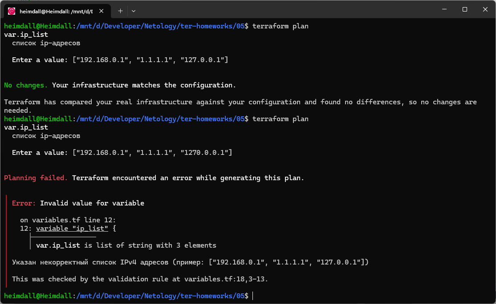


------
## Дополнительные задания (со звёздочкой*)

**Настоятельно рекомендуем выполнять все задания со звёздочкой.** Их выполнение поможет глубже разобраться в материале.   
Задания со звёздочкой дополнительные, не обязательные к выполнению и никак не повлияют на получение вами зачёта по этому домашнему заданию. 
------
### Задание 5*
1. Напишите переменные с валидацией:
- type=string, description="любая строка" — проверка, что строка не содержит символов верхнего регистра;
- type=object — проверка, что одно из значений равно true, а второе false, т. е. не допускается false false и true true:
```
variable "in_the_end_there_can_be_only_one" {
    description="Who is better Connor or Duncan?"
    type = object({
        Dunkan = optional(bool)
        Connor = optional(bool)
    })

    default = {
        Dunkan = true
        Connor = false
    }

    validation {
        error_message = "There can be only one MacLeod"
        condition = <проверка>
    }
}
```
------
### Задание 6*

1. Настройте любую известную вам CI/CD-систему. Если вы ещё не знакомы с CI/CD-системами, настоятельно рекомендуем вернуться к этому заданию после изучения Jenkins/Teamcity/Gitlab.
2. Скачайте с её помощью ваш репозиторий с кодом и инициализируйте инфраструктуру.
3. Уничтожьте инфраструктуру тем же способом.


------
### Задание 7*
1. Настройте отдельный terraform root модуль, который будет создавать инфраструктуру для remote state:
   - S3 bucket для tfstate с версионированием
   - Сервисный аккаунт с необходимыми правами (storage.editor)
   - Static access key для сервисного аккаунта
2. Output должен содержать:
   - Имя bucket
   - Access key ID и Secret key (sensitive)
   - Пример конфигурации backend для использования
3. После создания инфраструктуры используйте outputs для настройки backend в основном проекте.

**Примечание:** Так как используется `use_lockfile = true`, создавать YDB/DynamoDB больше не требуется.
Блокировки реализованы встроенным механизмом Terraform и хранятся в том же S3 bucket. 

### Правила приёма работы

Ответы на задания и необходимые скриншоты оформите в md-файле в ветке terraform-05.

В качестве результата прикрепите ссылку на ветку terraform-05 в вашем репозитории.

**Важно.** Удалите все созданные ресурсы.

### Критерии оценки

Зачёт ставится, если:

* выполнены все задания,
* ответы даны в развёрнутой форме,
* приложены соответствующие скриншоты и файлы проекта,
* в выполненных заданиях нет противоречий и нарушения логики.

На доработку работу отправят, если:

* задание выполнено частично или не выполнено вообще,
* в логике выполнения заданий есть противоречия и существенные недостатки. 


